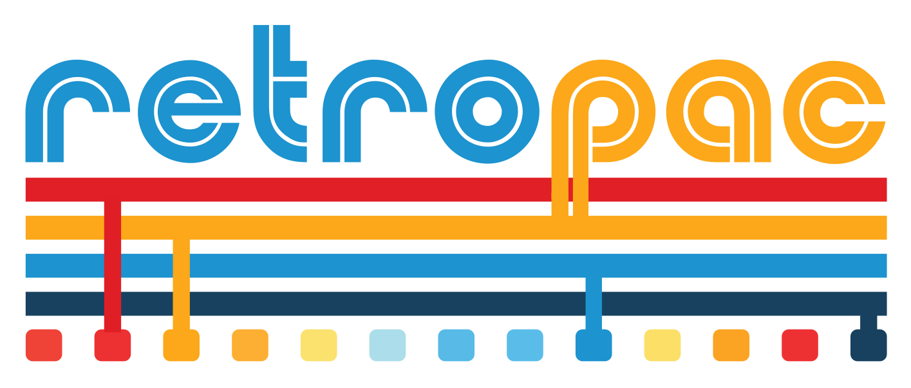

<p align="left">
  
</p>

# Ultimarc I-PAC LED Controller for RetroPie

This program controls LED lighting on Ultimarc I-PAC controllers based on the currently running emulator and ROM in RetroPie.  The software consists of a C playback engine that communicates via USB to the I-PAC controller, a C based RGBCommander config file format converter, a small C webserver that serves up the RetroPac animation editor that's written in Nuxt (Vue).

Technically this can run on other Raspberry Pi based game systems, making and installing are all the same.  You just need to have similar scripts that run when you start up a rom, end a rom and start up Emulation Station or other emulation software and pass certain info.  The LED contollers however, are only for Ultimarc I-PAC controllers.

<p>
  <a href="https://www.youtube.com/watch?v=M9VGTlF1cck" target="_blank">
    
  </a>
  <br>
  <a href="https://www.youtube.com/watch?v=M9VGTlF1cck">▶️Watch Video</a>
</p>

## Features

- Automatically lights up arcade buttons based on game controls
- **LED animations** for attract mode (rainbow, breathing, chase, sparkle, color cycle)
- **Custom animations** - Create your own animation sequences in JSON
- Supports multiple Ultimarc I-PAC controller models
- JSON-based configuration for emulators, ROMs, and button mappings
- Self-managing daemon mode (auto-kills previous instance)
- Integrates with RetroPie's runcommand scripts

## Requirements

- Raspberry Pi (tested on Raspberry Pi 3/4)
- RetroPie
- Ultimarc I-PAC controller (connected via USB)
- libjson-c library for JSON parsing
- libusb-1.0 for USB communication
- libxml2 (optional, for RGBcommander config converter)

## Installation

### Quick Install (Recommended)

The easiest way to install RetroPac is using the install script:

```bash
chmod +x install.sh
./install.sh
```

This will:
- Install all required system dependencies
- Install Node.js (if not present)
- Build retropac, anim-server, and the web interface
- Install to `/usr/local/bin/retropac`
- Create config at `/etc/retropac/config.json`

**Install script options:**
- `--no-web` - Skip building the web animation editor
- `--no-server` - Skip building the anim-server
- `--no-install` - Build only, don't install to system

### Manual Installation

If you prefer to install manually:

#### Install Dependencies

```bash
sudo apt-get update
sudo apt-get install -y build-essential libjson-c-dev libusb-1.0-0-dev libmicrohttpd-dev

# Optional: for RGBcommander config converter
sudo apt-get install -y libxml2-dev
```

#### Build

```bash
make
make server
```

#### Build Web Interface

```bash
cd web
npm install
npm run generate
cd ..
```

#### Install

```bash
sudo make install
```

This will install the binary to `/usr/local/bin/retropac` and config to `/etc/retropac/`.

### Build RGBcommander Converter (Optional)

If you have an existing RGBcommander configuration (`rgbcmdd.xml`), you can convert it to RetroPac format:

```bash
make converter
./bin/rgbcmd2retropac rgbcmdd.xml config.json
```

## Configuration

### JSON Config File

The default configuration file is located at `/etc/retropac/config.json`. You can specify a custom location with the `--config` option:

```bash
retropac --config /path/to/config.json mame sf2.zip
```

Example configuration:

```json
{
  "animations_dir": "/home/pi/retropac/animations",
  "ipac_controllers": [
    {
      "device": "ipac-ultimate",
      "vendor_id": "0xd209",
      "product_id": "0x0410"
    }
  ],
  "default": {
    "P1_COIN": "#FFFF00",
    "P1_START": "#FF0000",
    "P2_COIN": "#FFFF00",
    "P2_START": "#FF0000"
  },
  "emulators": {
    "mame": {
      "roms": {
        "sf2": {
          "P1_COIN": "#FFFF00",
          "P1_START": "#FF0000",
          "P1_BUTTON1": "#00FF00",
          "P1_BUTTON2": "#00FF00",
          "P1_BUTTON3": "#00FF00",
          "P1_BUTTON4": "#00FF00",
          "P1_BUTTON5": "#00FF00",
          "P1_BUTTON6": "#00FF00",
          "P1_JOYSTICK": "#FFFFFF"
        },
        "default": {
          "P1_COIN": "#FFFF00",
          "P1_START": "#FF0000",
          "P2_COIN": "#FFFF00",
          "P2_START": "#FF0000"
        }
      }
    }
  }
}
```

> **Important**: The `animations_dir` setting should use an **absolute path** when running retropac from RetroPie scripts. Relative paths won't work because the working directory varies depending on how retropac is launched.
```

### RetroPie Integration

#### USB Permissions

To allow non-root users to access the I-PAC controller, create a udev rule:

```bash
sudo nano /etc/udev/rules.d/99-ipac.rules
```

Add the following content:

```
# Ultimarc I-PAC controllers
SUBSYSTEM=="usb", ATTRS{idVendor}=="d209", MODE="0666"
SUBSYSTEM=="usb_device", ATTRS{idVendor}=="d209", MODE="0666"
```

> **Note**: Replace `d209` with your actual vendor ID if different. Run `lsusb | grep -i ultimarc` to find your device's vendor ID.

Reload udev rules and unplug/replug the controller:

```bash
sudo udevadm control --reload-rules
sudo udevadm trigger
```

#### Runcommand Scripts

Add to `/opt/retropie/configs/all/runcommand-onstart.sh`:

```bash
#!/bin/bash
# When a game starts, set static LEDs (auto-kills any running animation)
/usr/local/bin/retropac --quiet "$1" "$3"
```

Add to `/opt/retropie/configs/all/runcommand-onend.sh`:

```bash
#!/bin/bash
# When returning to EmulationStation, start attract mode animation
/usr/local/bin/retropac --custom pulse_red --daemon default default default
```

Make both scripts executable:

```bash
chmod +x /opt/retropie/configs/all/runcommand-onstart.sh
chmod +x /opt/retropie/configs/all/runcommand-onend.sh
```

#### EmulationStation Startup Animation

To start the attract mode animation when EmulationStation first launches (on boot), edit the autostart script:

```bash
nano /opt/retropie/configs/all/autostart.sh
```

Add the retropac command **before** the `emulationstation` line:

```bash
/usr/local/bin/retropac --custom pulse_red --daemon default default default &
emulationstation
```

> **Important**: The `&` at the end runs retropac in the background so EmulationStation continues to start. Without it, EmulationStation would wait for retropac to exit (which it won't in daemon mode).

## Usage

```bash
retropac [options] <emulator> <rom_path> [mode]
```

### Command Line Options

| Option | Description |
|--------|-------------|
| `--animate <type>` | Run built-in animation (see Animation Types below) |
| `--custom <name>` | Run custom animation by filename (without .json) |
| `--speed <ms>` | Animation speed in milliseconds (default: 50) |
| `--color <hex>` | Base color for animations (e.g., `#FF0000`) |
| `--daemon` | Run as background daemon |
| `--quiet` | Suppress all console output |
| `--help` | Show help message |

### Animation Types (Built-in)

| Type | Description |
|------|-------------|
| `rainbow` | Rotating rainbow colors across all buttons |
| `breathing` | Smooth fade in/out pulse effect |
| `chase` | Running light with trailing fade |
| `sparkle` | Random sparkle effect |
| `color_cycle` | Cycle through a list of colors |

### Examples

#### Basic Usage

Run with a specific game (sets LEDs based on emulator/ROM config):
```bash
retropac mame /home/pi/RetroPie/roms/mame/sf2.zip
```

Use default button configuration (EmulationStation menu):
```bash
retropac default default default
```

#### Built-in Animations

Run rainbow animation as daemon (background):
```bash
retropac --animate rainbow --daemon default default default
```

Run breathing animation with red color at 30ms speed:
```bash
retropac --animate breathing --color '#FF0000' --speed 30 default default default
```

Run chase animation in foreground (Ctrl+C to stop):
```bash
retropac --animate chase --color '#00FF00' default default default
```

Run sparkle animation with blue:
```bash
retropac --animate sparkle --color '#0000FF' --daemon default default default
```

#### Custom Animations

Run a custom animation by filename:
```bash
retropac --custom rainbow_wave default default default
```

Run custom animation as daemon:
```bash
retropac --custom rainbow_wave --daemon default default default
```

Run the idle animation configured in config.json:
```bash
retropac --custom idle --daemon default default default
```

#### RetroPie Integration Examples

When a game starts (in `runcommand-onstart.sh`):
```bash
#!/bin/bash
# Set static LEDs for the game (auto-kills any running animation)
/usr/local/bin/retropac "$1" "$3"
```

When a game ends (in `runcommand-onend.sh`):
```bash
#!/bin/bash
# Start attract mode with custom animation
/usr/local/bin/retropac --custom idle --daemon default default default

# Or use a built-in animation
# /usr/local/bin/retropac --animate rainbow --daemon default default default
```

### Self-Managing Daemon

RetroPac automatically manages its daemon process:
- Each invocation kills any existing retropac daemon
- PID is stored in `/tmp/retropac.pid`
- No need for manual `pkill` in shell scripts

## Supported Buttons

- P1_COIN, P2_COIN, P3_COIN, P4_COIN
- P1_START, P2_START, P3_START, P4_START
- P1_BUTTON1-6, P2_BUTTON1-6, P3_BUTTON1-6, P4_BUTTON1-6
- P1_JOYSTICK, P2_JOYSTICK, P3_JOYSTICK, P4_JOYSTICK
- P1_TRACKBALL, P2_TRACKBALL, P3_TRACKBALL, P4_TRACKBALL

## Custom Animations

RetroPac supports custom animations defined in JSON files. See [docs/ANIMATIONS.md](docs/ANIMATIONS.md) for the complete format specification.

### Quick Setup

1. Create an `animations` directory alongside your config.json
2. Add animation JSON files (e.g., `rainbow_wave.json`)
3. Configure the idle animation in config.json:

```json
{
  "animations_dir": "animations",
  "idle_animation": "rainbow_wave",
  "ipac_controllers": [...],
  "default": {...},
  "emulators": {...}
}
```

### Animation File Format

```json
{
  "name": "Rainbow Wave",
  "speed": 50,
  "loop": true,
  "frames": [
    {
      "buttons": [
        {"button": "P1_BUTTON1", "color": "#FF0000"},
        {"button": "P1_BUTTON2", "color": "#FF7F00"}
      ],
      "fade": true,
      "fade_speed_ms": 200
    }
  ]
}
```

| Field | Description |
|-------|-------------|
| `name` | Display name for the animation |
| `speed` | Base timing interval in milliseconds |
| `loop` | Whether animation repeats (true/false) |
| `frames` | Array of frame objects |

### Frame Fields

| Field | Description |
|-------|-------------|
| `buttons` | Array of button-color pairs to set in this frame |
| `fade` | Whether to fade to the colors |
| `fade_speed_ms` | Fade duration in milliseconds |

### Button-Color Pair Fields

| Field | Description |
|-------|-------------|
| `button` | Button identifier (e.g., "P1_BUTTON1") |
| `color` | Target color in hex format |

## Project Structure

```
retropac/
├── src/                    # Source files
│   ├── main.c              # Main program entry
│   ├── config.c            # JSON configuration parsing
│   ├── ipac.c              # I-PAC USB communication
│   └── animation.c         # LED animation engine
├── include/                # Header files
│   └── retropac.h
├── animations/             # Custom animation files
│   ├── rainbow_wave.json
│   ├── pulse_red.json
│   └── startup_sequence.json
├── web/                    # Animation Editor web app
│   ├── app.vue             # Main Vue component
│   ├── components/         # Vue components
│   └── composables/        # API composables
├── docs/                   # Documentation
│   └── ANIMATIONS.md       # Custom animation format docs
├── tools/                  # Utility tools
│   ├── rgbcmd2retropac.c   # RGBcommander converter
│   └── anim-server.c       # Animation Editor HTTP server
├── config.example.json     # Example configuration
├── Makefile
└── README.md
```

## Animation Editor

RetroPac includes a visual web-based animation editor for creating and editing custom animation files.

For complete setup instructions, see **[docs/EDITOR_SETUP.md](docs/EDITOR_SETUP.md)**.

### Quick Start

```bash
# Install dependencies
sudo apt install libmicrohttpd-dev libjson-c-dev
curl -fsSL https://deb.nodesource.com/setup_20.x | sudo -E bash -
sudo apt install nodejs

# Build server and web app
make server
cd web && npm install && npm run generate && cd ..

# Run the server
./bin/anim-server
```

Then open a browser on another computer and navigate to:
```
http://<your-raspberry-pi-ip>:8080
```

### Animation Editor Features

- **Visual arcade panel layout** - Click buttons to select them
- **Color picker** - Choose colors for selected buttons
- **Frame timeline** - Add, remove, and reorder animation frames
- **Drag-and-drop reordering** - Rearrange frames by dragging them in the timeline
- **Live preview** - Play animations with real-time frame highlighting
- **Frame settings** - Configure fade, fade speed, and delay per frame
- **Animation settings** - Set name, speed, and loop options
- **Save/Load** - Animations are saved directly to the animations directory
- **Full-width responsive layout** - Works on any screen size

## Config Editor

The web application also includes a **Config Editor** for managing your RetroPac configuration file (`config.json`) directly from the browser.

### Accessing the Config Editor

Navigate to the **Config** tab in the web interface, or go directly to:
```
http://<your-raspberry-pi-ip>:8080/config
```

### Config Editor Features

#### iPAC Controller Management
- **Add/Remove Controllers** - Manage multiple I-PAC controllers
- **Editable Device Settings** - Modify device name, vendor ID, and product ID
- **Pin Mappings** - Configure RGB pin numbers for each button
- **Add Button Dropdown** - Select from available button names (filters out already-used buttons)

#### Default Button Colors
- **Visual Color Picker** - Set default LED colors for each button
- **Add/Remove Buttons** - Configure which buttons have default colors
- **Button Name on Top** - Clear card layout with color picker below

#### Emulators & ROMs
- **Emulator Management** - Add, remove, and configure emulators
- **ROM Configuration** - Set per-ROM button colors
- **Duplicate ROM** - Quickly copy a ROM configuration as a starting point
- **Alphabetical Sorting** - Emulators and ROMs are sorted for easy navigation
- **Expandable Sections** - Collapse/expand ROMs to manage large configurations

#### General Features
- **Auto-Save Detection** - Unsaved changes are tracked with a visual indicator
- **Backup Function** - Create timestamped backups (`config-bak-yyyyMMddHHmmss.json`)
- **Toast Notifications** - Feedback for save, backup, and error states
- **Responsive Design** - Works on desktop and tablet screens

### API Endpoints

The server provides the following REST API endpoints for configuration:

| Method | Endpoint | Description |
|--------|----------|-------------|
| `GET` | `/api/config` | Get the full configuration |
| `PUT` | `/api/config` | Save the full configuration |
| `POST` | `/api/config/backup` | Create a backup of config.json |
| `GET` | `/api/buttons` | Get list of valid button names |
| `GET` | `/api/version` | Get server version info |

## License

MIT License
